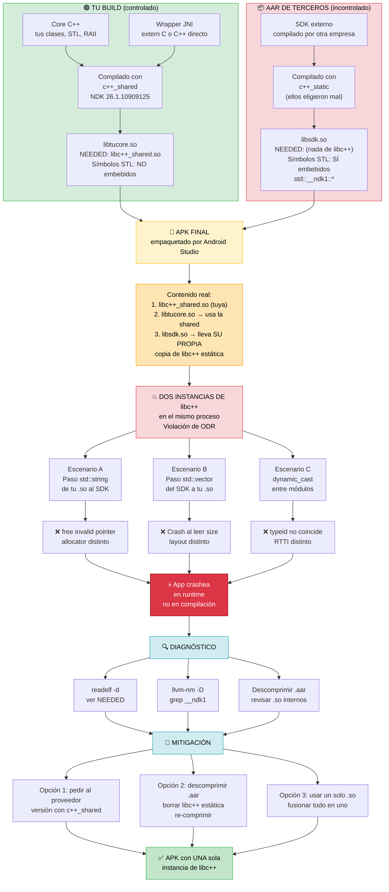

# Diagrama Mermaid: el problema de mezclar `c++_shared` con `c++_static`



---

## 🛠️ Comandos para auditar `.so` y `.aar`

Configura primero las herramientas del NDK:

```bash
NDK=/opt/homebrew/share/android-commandlinetools/ndk/26.1.10909125
TOOLS=$NDK/toolchains/llvm/prebuilt/darwin-x86_64/bin
```

### 1. Inspeccionar un `.so` suelto

```bash
# a) Ver dependencias dinámicas (NEEDED)
$TOOLS/llvm-readelf -d libfoo.so | grep NEEDED

# b) Ver si enlaza contra libc++_shared
$TOOLS/llvm-readelf -d libfoo.so | grep -i "libc++"

# c) Ver símbolos STL embebidos (namespace __ndk1 de libc++)
$TOOLS/llvm-nm -D --defined-only libfoo.so | grep __ndk1

# d) Contar cuántos símbolos STL tiene (0 = no embebe STL, >0 = sospechoso)
$TOOLS/llvm-nm -D --defined-only libfoo.so | grep -c __ndk1

# e) Ver símbolos C++ (demangled) que exporta
$TOOLS/llvm-nm -D --defined-only -C libfoo.so | head -50

# f) Ver arquitectura (arm64-v8a, armeabi-v7a, x86_64...)
$TOOLS/llvm-readelf -h libfoo.so | grep Machine
```

### 2. Inspeccionar un `.aar`

Un `.aar` es un ZIP. Dentro tiene `jni/<abi>/*.so`.

```bash
# a) Listar contenido del .aar
unzip -l libsdk.aar

# b) Extraer solo los .so a una carpeta temporal
mkdir -p /tmp/aar_extract
unzip -o libsdk.aar 'jni/**' -d /tmp/aar_extract

# c) Listar los .so encontrados
find /tmp/aar_extract -name "*.so"

# d) Auditar cada .so con el bucle del punto 1
for so in $(find /tmp/aar_extract -name "*.so"); do
    echo "=== $so ==="
    $TOOLS/llvm-readelf -d "$so" | grep NEEDED
    echo "Símbolos STL embebidos: $($TOOLS/llvm-nm -D --defined-only "$so" | grep -c __ndk1)"
done
```

### 3. Inspeccionar un APK completo

Un APK es un ZIP. Los `.so` viven en `lib/<abi>/`.

```bash
# a) Listar todos los .so del APK
unzip -l app-release.apk | grep "\.so$"

# b) Extraer todos los .so
mkdir -p /tmp/apk_extract
unzip -o app-release.apk 'lib/**' -d /tmp/apk_extract

# c) Auditar cada .so
for so in $(find /tmp/apk_extract -name "*.so"); do
    echo ""
    echo "=== $so ==="
    echo "-- NEEDED --"
    $TOOLS/llvm-readelf -d "$so" | grep NEEDED
    echo "-- Símbolos STL embebidos (__ndk1): --"
    $TOOLS/llvm-nm -D --defined-only "$so" 2>/dev/null | grep -c __ndk1
done
```

### 4. Detectar duplicados de `libc++_shared.so`

```bash
# Cuántas copias de libc++_shared.so hay en el APK
unzip -l app-release.apk | grep "libc++_shared.so"

# Debería aparecer UNA por ABI (arm64-v8a, armeabi-v7a, x86, x86_64)
# Si aparece más de una por ABI → problema
```

### 5. Script "todo en uno" para auditar un APK

```bash
#!/usr/bin/env bash
# auditar_apk.sh
NDK=/opt/homebrew/share/android-commandlinetools/ndk/26.1.10909125
TOOLS=$NDK/toolchains/llvm/prebuilt/darwin-x86_64/bin
APK="$1"

if [ -z "$APK" ]; then
    echo "Uso: $0 app.apk"
    exit 1
fi

TMP=$(mktemp -d)
unzip -q -o "$APK" 'lib/**' -d "$TMP"

echo "🔍 Auditando $APK"
echo "========================"

for so in $(find "$TMP" -name "*.so" | sort); do
    echo ""
    echo "📦 $(basename "$so")"
    echo "   Ruta: ${so#$TMP/}"

    # NEEDED
    NEEDED=$($TOOLS/llvm-readelf -d "$so" 2>/dev/null | grep NEEDED | awk '{print $NF}' | tr -d '[]')
    echo "   NEEDED:"
    echo "$NEEDED" | sed 's/^/     /'

    # ¿Enlaza shared?
    if echo "$NEEDED" | grep -q "libc++_shared.so"; then
        echo "   ✅ Enlaza libc++_shared (correcto)"
    fi

    # ¿Tiene STL embebida?
    STL_COUNT=$($TOOLS/llvm-nm -D --defined-only "$so" 2>/dev/null | grep -c __ndk1)
    if [ "$STL_COUNT" -gt 0 ]; then
        echo "   ⚠️  Símbolos STL embebidos: $STL_COUNT (posible c++_static)"
    else
        echo "   ✅ Sin símbolos STL embebidos"
    fi

    # Arquitectura
    ARCH=$($TOOLS/llvm-readelf -h "$so" 2>/dev/null | grep Machine | awk -F: '{print $2}' | xargs)
    echo "   🏗️  Arch: $ARCH"
done

echo ""
echo "========================"
echo "📊 Resumen de libc++_shared.so en el APK:"
unzip -l "$APK" | grep "libc++_shared.so" || echo "  (ninguna copia encontrada)"

rm -rf "$TMP"
```

Guárdalo como `auditar_apk.sh`, dale permisos y úsalo:

```bash
chmod +x auditar_apk.sh
./auditar_apk.sh app-release.apk
```

---

## 📊 Tabla de interpretación rápida

| Resultado de `llvm-nm -D | grep -c __ndk1` | Significado |
|---|---|
| `0` | ✅ No embebe STL (correcto si usas `c++_shared`) |
| `>0` y `readelf -d` muestra `libc++_shared.so` | ⚠️ Raro: shared + símbolos visibles |
| `>0` y `readelf -d` NO muestra `libc++` | ❌ **c++_static embebido** → problema |
| `0` pero el `.so` está stripped | ⚠️ No se puede saber con `nm`, usar `strings` |

### Fallback para `.so` stripped

Si el `.so` no tiene símbolos dinámicos visibles:

```bash
# Buscar strings del namespace __ndk1
$TOOLS/llvm-strings libfoo.so | grep -i "__ndk1" | head

# Buscar nombres de símbolos STL comunes
$TOOLS/llvm-strings libfoo.so | grep -E "basic_string|__shared_ptr|__vector" | head
```

---

## 🎯 Regla mental para tu proyecto

1. **Tu build → siempre `c++_shared`** (ya lo tienes en `android_armv8`).
2. **Cualquier `.aar` de terceros → auditar con el script antes de meterlo**.
3. **Si el `.so` del tercero trae STL embebida → contactar al proveedor o extraer y limpiar**.
4. **Un APK sano tiene exactamente una `libc++_shared.so` por ABI**.

Con esto tienes un kit completo para detectar la "contaminación silenciosa" antes de que crashee en producción. ¿Quieres que te arme también el equivalente para inspeccionar `.a` estáticas (que no se pueden auditar con `readelf -d` pero sí con `ar` + `nm`)?